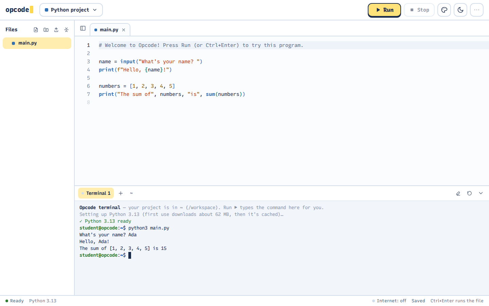
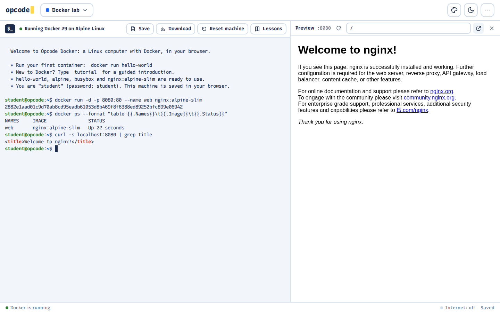
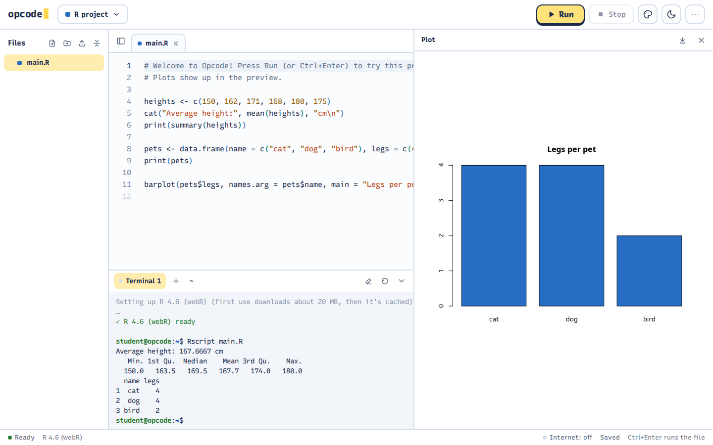
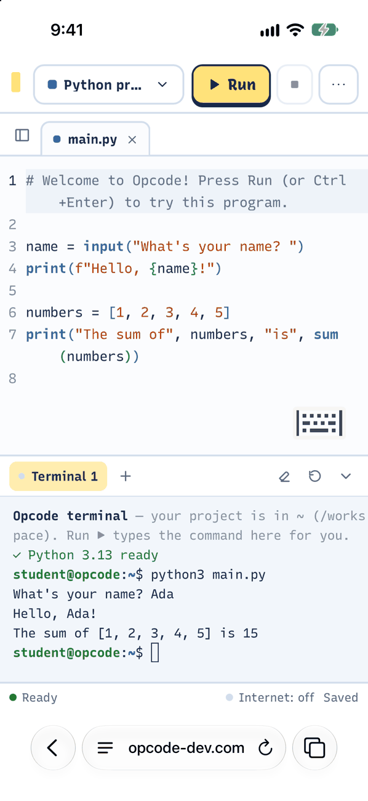
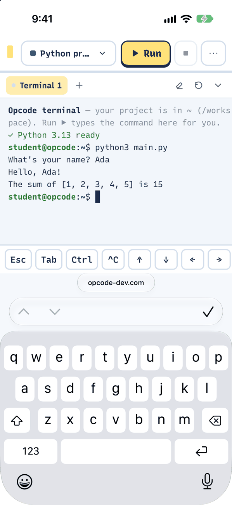
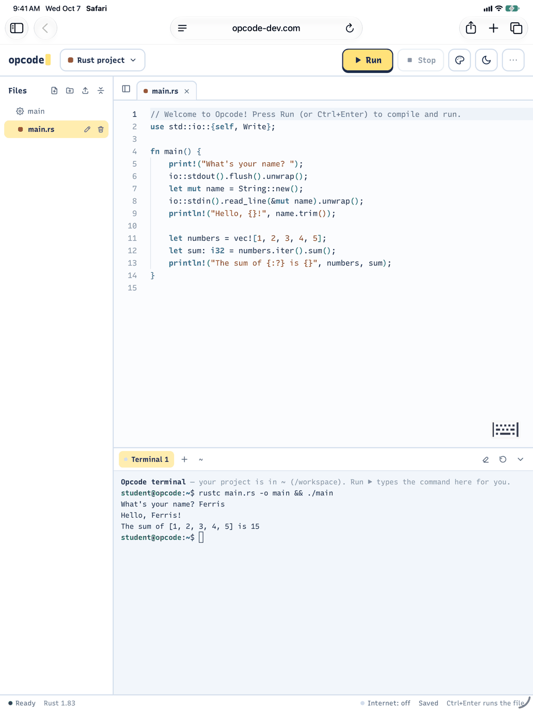
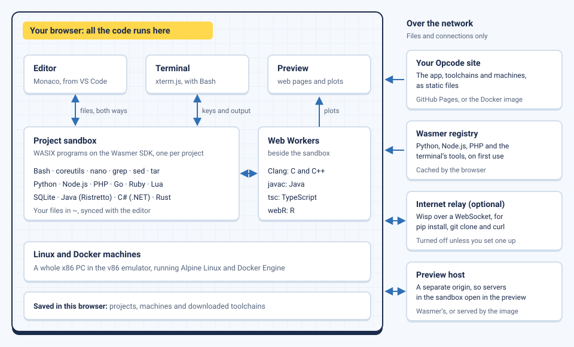

# Opcode

**A browser IDE with a real terminal.** Write and run code in 16 languages, or learn the Linux command line and Docker on a real Linux computer, with nothing to install. Everything runs in your browser on WebAssembly: no server ever runs your code.

**[Try it](https://opcode-dev.com)** · [Documentation](docs/README.md) · [Host your own](docs/deploying.md)

<picture>
  <source media="(prefers-color-scheme: dark)" srcset="docs/images/coding-dark.png">
  
</picture>

## Features

- **A real terminal for every project**: Bash, coreutils, `nano` and your files in `~`, with real compilers and interpreters. **Run** types the command for you (`python3 main.py`, `cargo run`, `dotnet run`), so you see what happens and can change it. Programs read keyboard input, and **Ctrl+C** stops them.
- **16 languages**: Python, web pages, JavaScript, TypeScript, Java, C#, C, C++, Rust, Go, Ruby, PHP, R, Lua, SQL and Bash. Each downloads the first time you use it, then comes from the browser's cache.
- **Linux and Docker machines**: a real Alpine Linux computer, and one with Docker Engine, each with a built-in tutorial that checks your work.
- **Web preview**: servers started in the terminal, web pages and R's plots open beside the editor.
- **Your code stays with you**: projects and machines are saved in your browser, and never uploaded.
- **Works in Chrome, Edge, Firefox and Safari**, on computers and Chromebooks, and on iPhone and iPad (iOS 27 or later) and Android phones and tablets.
- **Made for touch too**: on a phone the screen goes to the editor or the terminal you're typing in, a key bar adds Esc, Tab, Ctrl, Ctrl+C and the arrows above the keyboard, and a finger scrolls the terminal.

<table>
  <tr>
    <td width="50%"></td>
    <td width="50%"></td>
  </tr>
  <tr>
    <td align="center">Real Docker, with a container's web page in the preview</td>
    <td align="center">R, with its plots in the preview</td>
  </tr>
</table>

### On iPhone and iPad

<table>
  <tr>
    <td align="center" width="27%"></td>
    <td align="center" width="27%"></td>
    <td align="center" width="46%"></td>
  </tr>
  <tr>
    <td align="center">Python on an iPhone</td>
    <td align="center">The terminal and its key bar, above the keyboard</td>
    <td align="center">Rust, compiled and run on an iPad</td>
  </tr>
</table>

## How it works

<picture>
  <source media="(prefers-color-scheme: dark)" srcset="docs/images/architecture-dark.svg">
  
</picture>

Each project runs in its own sandbox of WASIX programs on the [Wasmer SDK](https://github.com/wasmerio/wasmer-sdk), compilers such as Clang run in Web Workers, and the Linux and Docker machines are whole x86 PCs emulated by [v86](https://github.com/copy/v86). The server only hands out files, so Opcode can be hosted as a static site. More in [How it works](docs/architecture.md).

## Quick start

**Use it**: open https://opcode-dev.com, on a computer, phone or tablet.

**Run it locally** (Node.js 20 or later):

```bash
npm install
npm run dev        # then open http://localhost:5173
```

**Host your own**, with the Docker image:

```bash
docker run --rm -p 8080:8080 ghcr.io/tks98/opcode     # then open http://localhost:8080
```

or as a static site, such as GitHub Pages. [Deploying](docs/deploying.md) covers HTTPS, internet access for terminals, and the settings.

## Documentation

| | |
| --- | --- |
| [Using Opcode](docs/using-opcode.md) | Projects, the terminal, files, the web preview, keyboard shortcuts |
| [Languages](docs/languages.md) | Every language: its run command, toolchain and download size |
| [Linux and Docker machines](docs/linux-and-docker.md) | The machines, their tutorials, saving and sharing them |
| [Deploying](docs/deploying.md) | The Docker image, static hosting, the internet relay and the preview host |
| [How it works](docs/architecture.md) | The sandbox, the shell, the compilers and file sync |
| [Development](docs/development.md) | Scripts, tests and the project's layout |
| [Limitations](docs/limitations.md) | What doesn't work, or works differently |
| [Design](docs/design.md) | Colours, type and the notebook look |

## License

Copyright © 2026 tks98. Opcode is free software under the [GNU Affero General Public License](LICENSE), version 3 or later: if you run a changed version for other people, offer them its source code (the start screen links to it, `SOURCE_URL` in `src/lib/components/StartScreen.svelte`). It includes and serves other open source software, listed with its licenses in [THIRD_PARTY_NOTICES.md](THIRD_PARTY_NOTICES.md).
