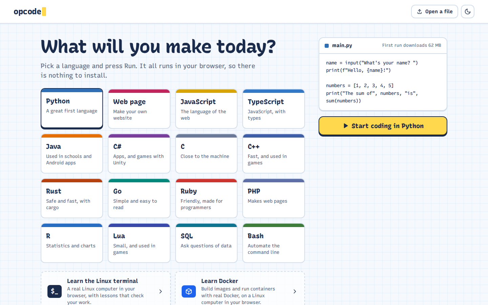

[← Documentation](README.md)

# Using Opcode

Open Opcode and pick a language: the starter program is one click on **Run** away. Every project gets its own Linux-like sandbox: a Bash shell with coreutils, your files in `~`, and real compilers and interpreters. Press **Run** and Opcode types the command for you (`python3 main.py`, `clang … && ./main`, `cargo run`, `dotnet run`), so you can see what happened, repeat it, or edit it yourself. Programs can read input (`input()`, `scanf`, `std::cin`, `Scanner`, `Console.ReadLine`, `gets`, `io.read`, `readline`, `fgets`), and **Stop** or **Ctrl+C** ends them.

## Features

- **Start screen**: pick a language (each card shows its starter program and how much it downloads), or carry on with a recent project. It opens on a first visit and from the logo; returning visitors go straight back to their last project
- **Real terminal**: Bash with pipes, redirection and history (↑), coreutils, `grep`, `sed`, `find`, `tar`, `less`, `stty`, and the `nano` editor, in [xterm.js](https://xtermjs.org/)
- **Run button**: runs the active file in the terminal; Ctrl/Cmd+Enter does the same
- **SQL**: `.sql` files run on SQLite and print their results as tables; `sqlite3` works in every terminal, for database files too
- **Web pages**: HTML, CSS and JavaScript projects. Run serves the folder (`serve` in the terminal) and opens the page in the preview, which updates as you type
- **`code <file>`** in the terminal opens (or creates) a file in the editor, like VS Code
- **Files stay in sync both ways**: edits go to the terminal immediately, and files the terminal creates, changes or deletes show up in the editor (compiled programs appear greyed out)
- **Folders**: nested folders, rename and move, drag-and-drop or upload files, ZIP import and export
- **Monaco editor**: VS Code's editor, with per-file undo history and syntax highlighting for dozens of languages
- **Internet access** (with a relay, see [Deploying](deploying.md#internet-relay)): `pip install`, `git clone`, `curl` and API calls work from terminals and Linux machines. The status bar shows *Internet: on*/*off* and opens the settings.
- **Web preview**: start a server in the terminal (`python3 -m http.server`, `php -S localhost:8000`, a Node or Flask app, or `docker run -p 8080:80 nginx` on a Docker machine) and its page opens in a preview panel beside the editor. R's plots show there too. It follows the server as you stop and restart it, and `http://localhost:…` links in the terminal open there too. With a [wildcard preview host](deploying.md#web-preview-host), every server gets its own address, so several can run and be previewed (or opened in their own tabs) at once.
- **Types like a native terminal**: type the next command while one runs, or paste several lines (even a `for` loop), and they run in order
- **Several terminals per project**: open more tabs with **+** (Ctrl+Shift+`); each has its own shell, directory and running program, and Run uses the active one
- **Multiple projects**: switch, rename and delete them from the project menu at the top; each keeps its own terminal sessions
- **Light and dark, and editor colours**: a notebook look by day and a blueprint by night (following your system until you choose), plus five colour themes for the editor and terminals, including two high-contrast ones. See [Design](design.md)
- **Works on phones and tablets**, iPhone and iPad included (iOS 27 or later):
  - the files become a drawer, Run stays in reach, and long lines wrap in the editor
  - while the on-screen keyboard is up, the screen goes to the editor or the terminal you're typing in; Run moves the keyboard to the terminal
  - a key bar above the keyboard has Esc, Tab, Ctrl (tap it, then a letter), Ctrl+C, the arrows (↑ brings back the last command), `|`, `~`, `/` and `-`
  - drag a finger to scroll the terminal; a tap brings up the keyboard
- **Saved automatically**: projects and terminal history are stored in your browser (IndexedDB)

## Keyboard shortcuts

- `Ctrl/Cmd + Enter`: run the active file
- `Ctrl + C` (in the terminal): stop the running program
- ``Ctrl + ` ``: show and focus the terminal
- ``Ctrl + Shift + ` ``: open another terminal
- `Ctrl/Cmd + S`: does nothing harmful (everything saves automatically)
- `Escape`: closes menus, dialogs and (on phones) the files drawer; arrow keys move through menus
